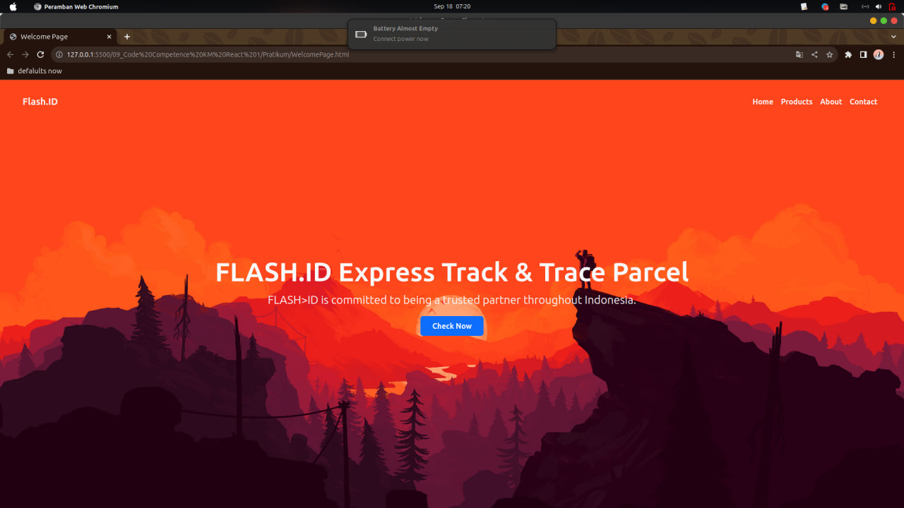

🎯 Objective
Pembuatan sebuah halaman menggunakan HTML, CSS/Framework CSS, dan JS. halaman ini berada pada satu index.html sehingga tidak perlu melakukan routing. Beberapa hal yang perlu untuk dibuat ada di bagian kriteria

🔍 Criteria

Kumpulkan pada repo yang kalian buat untuk mengumpulkan tugas. Berilah nama foldernya codeCompetance1
Buat folder project yang berisikan kode yang kalian buat
Buat folder screenshot dan masukkan hasil dari kode yang kalian buat

Buatlah sebuah footer untuk halaman website kalian. Footer tersebut memiliki beberapa komponen yaitu
Terdapat link sosial media kalian (minimal 3)
Terdapat nama dari website
Terdapat nomor telepon dan juga alamat
Bagian lain dapat dibuat sesuai keinginan kalian, tapi tiga komponen diatas merupakan standar minimal. Design pada gambar di bawah hanya contoh. Kalian bebas menggunakan design yang kalian inginkan.

Project 2

Buatlah welcome page dan lakukan pemasangan bootstrap pada halaman kalian. Dan buatlah beberapa hal
Header(memiliki logo dan juga navigation bar)
Welcome section (terdapat gambar dan kata-kata yang menarik user)
Gambar di bawah hanya sebagai contoh untuk kalian, kalian bebas menerapkan design yang kalian inginkan. Kalian juga boleh menggunakan component bootstrap.

Buat lah contact us (dengan framework bootstrap) dengan kriteria dari aplikasi adalah sebagai berikut:
Memiliki 4 buat form(username bertime text, email bertime email, message bertipe text area)
Memiliki button submit (jika kita menekan tombol submit maka keluar alert yang berisikan data yang kita masukkan pada form)
