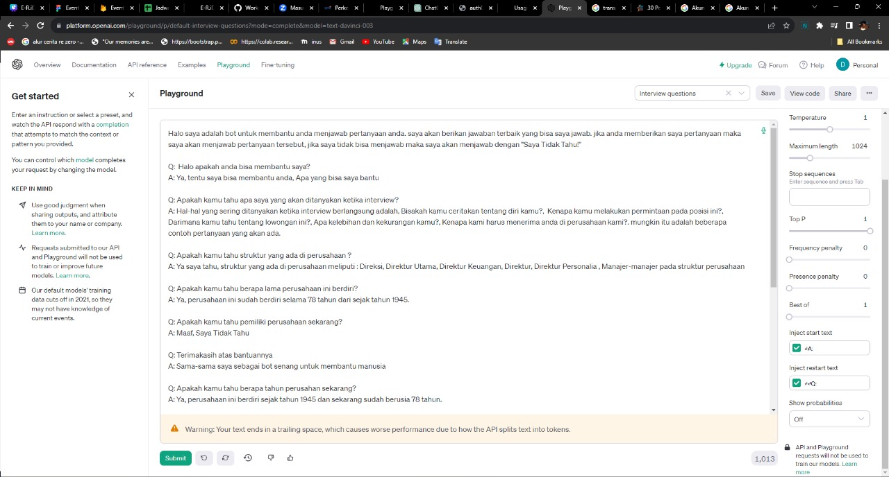
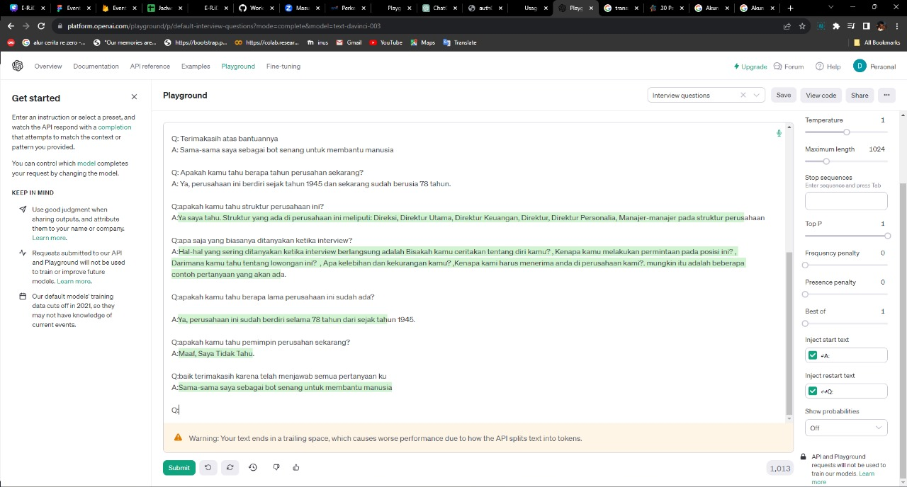

Screeshots diatas merupakan hasil dari Playground yang telah saya lakukan di Openai dimana semisal kita lihat gambar diatas sudah terjadi aksi tanya jawab antara Q dan A, dimana Q itu adalah peratanyaan yang diajukan sedangkan A merupakan jawaban dari pertanyaan itu. selain itu jika kita melihat di side bar kanan itu ada beberapa konfigurasi sebelum kita melakukan tanya jawab. untuk settingannyasaya di sini menggunakan text-davinci-003 dan memilih mode complete selain itu disini saya membuat temperature yang ada menjadi 1ini memungkinkan untuk jawaban bisa secara sedikit random dan bagian terpenting dalam kita untuk melakukan setting adalah pada bagian inject start text dan inject restart text disini kita melakukan konfigurasi seperti ini bertujuan untuk sistem tahu dari kalimat mana mereka harus menjawab. selain itu hasil dari apa yang sudah di buat dan di tanyakan sesuai dengan set yang atas. cara membedakannya adalah jika ada blok warna hijau pada text itu adalah jawaban dari ai nya.